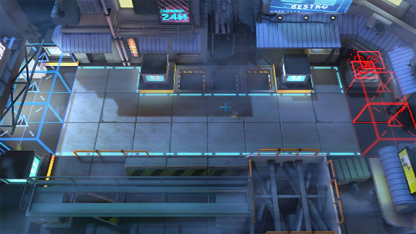

# 关卡一览————ISW-NO_法术与铁砧

## 关卡一览

关卡编号: ISW-NO_法术与铁砧

关卡名称: 法术与铁砧

目标点生命值: 100

敌人总数: 36

理智消耗: 0

## 关卡地图

## 敌人情况

| 敌人图片 | 敌人名称 | 数量  |
|---------|-----|-----|
| ./eneIcons/eneIcons/·¨Êõ´óʦA2.png| 法术大师A2  |   7  |
| ./eneIcons/eneIcons/·¨Êõ½üÎÀ×鳤.png| 法术近卫组长  |   10  |
| ./eneIcons/eneIcons/·ÛËé¹¥¼áÊÖ.png| 粉碎攻坚手  |   4  |
| ./eneIcons/eneIcons/¸ßÆÕÄá¿Ë.png| 高普尼克  |   1  |
| ./eneIcons/eneIcons/ÆÆÕóÕß×鳤.png| 破阵者组长  |   4  |
| ./eneIcons/eneIcons/Çá¼×ÎÀ±ø×鳤.png| 轻甲卫兵组长  |   14  |
| ./eneIcons/eneIcons/Ѽ¾ô.png| 鸭爵  |   1  |
