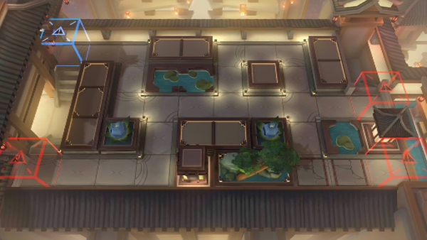

# 关卡一览————IW-2

## 关卡一览

关卡编号: IW-2

关卡名称: 无寻处

目标点生命值: 3

敌人总数: 38

理智消耗: 9

## 关卡地图

## 敌人情况

| 敌人图片 | 敌人名称 | 数量  |
|---------|-----|-----|
| ./eneIcons/eneIcons/Ä¥íÃ.png| 磨砻  |   23  |
| ./eneIcons/eneIcons/ľÖÆÈðÓ¡.png| 木制瑞印  |   0  |
| ./eneIcons/eneIcons/Ë×ÐÄ.png| 俗心  |   15  |
| ./eneIcons/eneIcons/С˵¾íÖá.png| 小说卷轴  |   0  |
