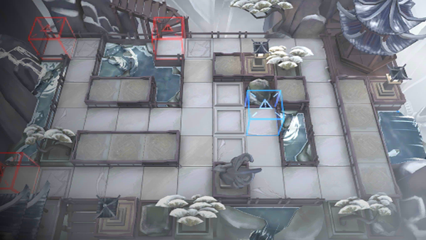

# 关卡一览————IW-6

## 关卡一览

关卡编号: IW-6

关卡名称: 传说

目标点生命值: 3

敌人总数: 24

理智消耗: 18

## 关卡地图

## 敌人情况

| 敌人图片 | 敌人名称 | 数量  |
|---------|-----|-----|
| ./eneIcons/eneIcons/Ä«ÀË.png| 墨浪  |   2  |
| ./eneIcons/eneIcons/ľÖÆÕòÖ½.png| 木制镇纸  |   0  |
| ./eneIcons/eneIcons/Çà´É»¨Æ¿.png| 青瓷花瓶  |   0  |
| ./eneIcons/eneIcons/Ç໨.png| 青花  |   2  |
| ./eneIcons/eneIcons/ÇàÍ­¾µ.png| 青铜镜  |   0  |
| ./eneIcons/eneIcons/Éí¹Û.png| 身观  |   3  |
| ./eneIcons/eneIcons/Ë×ÐÄ.png| 俗心  |   17  |
| ./eneIcons/eneIcons/С˵¾íÖá.png| 小说卷轴  |   0  |
