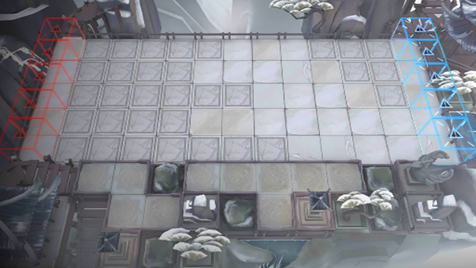

# 关卡一览————IW-9

## 关卡一览

关卡编号: IW-9

关卡名称: 岁相

目标点生命值: 3

敌人总数: 91

理智消耗: 10

## 关卡地图

## 敌人情况

| 敌人图片 | 敌人名称 | 数量  |
|---------|-----|-----|
| ./eneIcons/eneIcons/Á×»ð.png| 磷火  |   70  |
| ./eneIcons/eneIcons/Ä¥íÃ.png| 磨砻  |   5  |
| ./eneIcons/eneIcons/ľÖÆÈðÓ¡.png| 木制瑞印  |   0  |
| ./eneIcons/eneIcons/ÇàÍ­¾µ.png| 青铜镜  |   0  |
| ./eneIcons/eneIcons/Éí¹Û.png| 身观  |   1  |
| ./eneIcons/eneIcons/Ë×ÐÄ.png| 俗心  |   12  |
| ./eneIcons/eneIcons/ËêÏà.png| 岁相  |   3  |
| ./eneIcons/eneIcons/С˵¾íÖá.png| 小说卷轴  |   0  |
