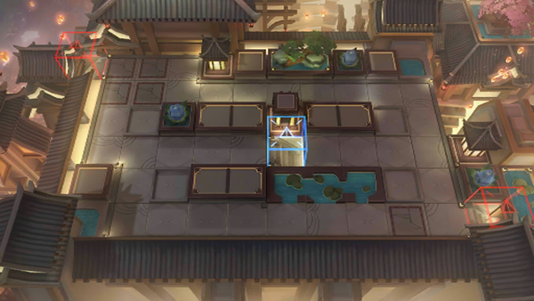

# 关卡一览————IW-EX-4

## 关卡一览

关卡编号: IW-EX-4

关卡名称: 茶棚

目标点生命值: 3

敌人总数: 18

理智消耗: 15

## 关卡地图

## 敌人情况

| 敌人图片 | 敌人名称 | 数量  |
|---------|-----|-----|
| ./eneIcons/eneIcons/²Ê´É»¨Æ¿.png| 彩瓷花瓶  |   0  |
| ./eneIcons/eneIcons/³Áɳ.png| 沉沙  |   2  |
| ./eneIcons/eneIcons/³àϼ.png| 赤霞  |   8  |
| ./eneIcons/eneIcons/ÇàÍ­¾µ.png| 青铜镜  |   0  |
| ./eneIcons/eneIcons/Éí¹Û.png| 身观  |   8  |
| ./eneIcons/eneIcons/ͭìͷ.png| 铜矛头  |   0  |
