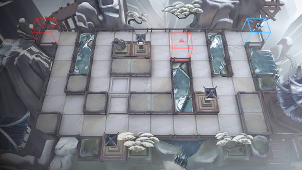

# 关卡一览————IW-EX-5

## 关卡一览

关卡编号: IW-EX-5

关卡名称: 梁府

目标点生命值: 3

敌人总数: 28

理智消耗: 15

## 关卡地图

## 敌人情况

| 敌人图片 | 敌人名称 | 数量  |
|---------|-----|-----|
| ./eneIcons/eneIcons/ºìľÈðÓ¡.png| 红木瑞印  |   0  |
| ./eneIcons/eneIcons/ºìľÕòÖ½.png| 红木镇纸  |   0  |
| ./eneIcons/eneIcons/»ÆÍ­¾µ.png| 黄铜镜  |   0  |
| ./eneIcons/eneIcons/Ã÷¼ø.png| 明鉴  |   4  |
| ./eneIcons/eneIcons/Ê«»­¾íÖá.png| 诗画卷轴  |   0  |
| ./eneIcons/eneIcons/ÌûÊ.png| 堂皇  |   2  |
| ./eneIcons/eneIcons/ÌúµÆÅÌ.png| 铁灯盘  |   0  |
| ./eneIcons/eneIcons/ÐÄÌÎ.png| 心涛  |   6  |
| ./eneIcons/eneIcons/ÑÅÆø.png| 雅气  |   10  |
| ./eneIcons/eneIcons/ÑÔÊ¡.png| 言省  |   6  |
