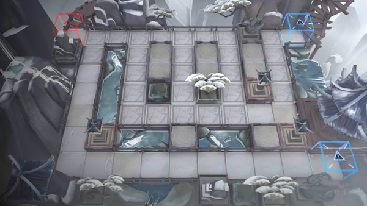

# 关卡一览————IW-EX-6

## 关卡一览

关卡编号: IW-EX-6

关卡名称: 边塞

目标点生命值: 3

敌人总数: 12

理智消耗: 15

## 关卡地图

## 敌人情况

| 敌人图片 | 敌人名称 | 数量  |
|---------|-----|-----|
| ./eneIcons/eneIcons/ºìľÈðÓ¡.png| 红木瑞印  |   0  |
| ./eneIcons/eneIcons/»ÆÍ­¾µ.png| 黄铜镜  |   0  |
| ./eneIcons/eneIcons/Ã÷¼ø.png| 明鉴  |   4  |
| ./eneIcons/eneIcons/Ìúìͷ.png| 铁矛头  |   0  |
| ./eneIcons/eneIcons/ÐÂíÊ.png| 新硎  |   6  |
| ./eneIcons/eneIcons/ÑÔÊ¡.png| 言省  |   2  |
