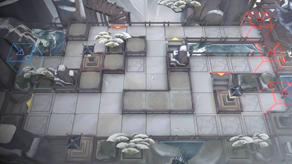

# 关卡一览————IW-EX-7

## 关卡一览

关卡编号: IW-EX-7

关卡名称: 寻日峰

目标点生命值: 3

敌人总数: 41

理智消耗: 20

## 关卡地图

## 敌人情况

| 敌人图片 | 敌人名称 | 数量  |
|---------|-----|-----|
| ./eneIcons/eneIcons/²Ê´É²èÆ÷.png| 彩瓷茶器  |   0  |
| ./eneIcons/eneIcons/ºìľÈðÓ¡.png| 红木瑞印  |   0  |
| ./eneIcons/eneIcons/Ã÷¼ø.png| 明鉴  |   20  |
| ./eneIcons/eneIcons/Æãºç.png| 沏虹  |   3  |
| ./eneIcons/eneIcons/Ê«»­¾íÖá.png| 诗画卷轴  |   0  |
| ./eneIcons/eneIcons/ÌûÊ.png| 堂皇  |   3  |
| ./eneIcons/eneIcons/ÌúµÆÅÌ.png| 铁灯盘  |   0  |
| ./eneIcons/eneIcons/ÑÅÆø.png| 雅气  |   15  |
