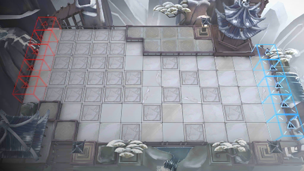

# 关卡一览————IW-EX-8

## 关卡一览

关卡编号: IW-EX-8

关卡名称: 忘水坪

目标点生命值: 3

敌人总数: 86

理智消耗: 20

## 关卡地图

## 敌人情况

| 敌人图片 | 敌人名称 | 数量  |
|---------|-----|-----|
| ./eneIcons/eneIcons/ºìľÕòÖ½.png| 红木镇纸  |   0  |
| ./eneIcons/eneIcons/»ÆÍ­¾µ.png| 黄铜镜  |   0  |
| ./eneIcons/eneIcons/Á×»ð.png| 磷火  |   70  |
| ./eneIcons/eneIcons/Ê«»­¾íÖá.png| 诗画卷轴  |   0  |
| ./eneIcons/eneIcons/ËêÏà.png| 岁相  |   3  |
| ./eneIcons/eneIcons/ÐÄÌÎ.png| 心涛  |   6  |
| ./eneIcons/eneIcons/ÑÅÆø.png| 雅气  |   5  |
| ./eneIcons/eneIcons/ÑÔÊ¡.png| 言省  |   2  |
