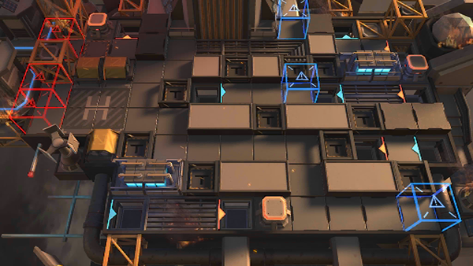

# 关卡一览————JT8-3

## 关卡一览

关卡编号: JT8-3

关卡名称: 昂首，足践烈焰

目标点生命值: 3

敌人总数: 44

理智消耗: 18

## 关卡地图

## 敌人情况

| 敌人图片 | 敌人名称 | 数量  |
|---------|-----|-----|
| ./eneIcons/eneIcons/²»ËÀµÄºÚÉß.png| 不死的黑蛇  |   1  |
| ./eneIcons/eneIcons/ÎÚÈø˹ÁÑÊÞ.png| 乌萨斯裂兽  |   28  |
| ./eneIcons/eneIcons/ÎÚÈø˹ͻ»÷Õß.png| 乌萨斯突击者  |   9  |
| ./eneIcons/eneIcons/ÎÚÈø˹×ÅîøÊõʦ.png| 乌萨斯着铠术师  |   6  |
