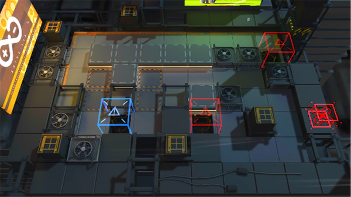

# 关卡一览————LK-DP-B

## 关卡一览

关卡编号: LK-DP-B

关卡名称: 白昼之地-幻象

目标点生命值: 1

敌人总数: 34

理智消耗: 0

## 关卡地图

## 敌人情况

| 敌人图片 | 敌人名称 | 数量  |
|---------|-----|-----|
| ./eneIcons/eneIcons/±©Í½.png| 暴徒  |   6  |
| ./eneIcons/eneIcons/»¤¶Ü¸ß½×Êõʦ.png| 护盾高阶术师  |   1  |
| ./eneIcons/eneIcons/Çá¼×ÎÀ±ø.png| 轻甲卫兵  |   10  |
| ./eneIcons/eneIcons/È­ÈÐÎäÊ¿.png| 拳刃武士  |   9  |
| ./eneIcons/eneIcons/Îä×°ÈËÔ±.png| 武装人员  |   1  |
| ./eneIcons/eneIcons/Óù4.png| 御4  |   3  |
| ./eneIcons/eneIcons/ÖØ×°·ÀÓùÕß.png| 重装防御者  |   4  |
