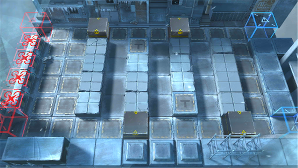

# 关卡一览————LK-DP-D

## 关卡一览

关卡编号: LK-DP-D

关卡名称: 白昼之地-坚守

目标点生命值: 1

敌人总数: 42

理智消耗: 0

## 关卡地图

## 敌人情况

| 敌人图片 | 敌人名称 | 数量  |
|---------|-----|-----|
| ./eneIcons/eneIcons/˪ÐÇ£¬¡°¶¬ºÛ¡±.png| 霜星，“冬痕”  |   1  |
| ./eneIcons/eneIcons/˪ÑÀ.png| 霜牙  |   11  |
| ./eneIcons/eneIcons/Ñ©¹ÖÊõʦ.png| 雪怪术师  |   2  |
| ./eneIcons/eneIcons/Ñ©¹ÖС¶Ó.png| 雪怪小队  |   10  |
| ./eneIcons/eneIcons/Ñý¹ÖMKII.png| 妖怪MKII  |   18  |
