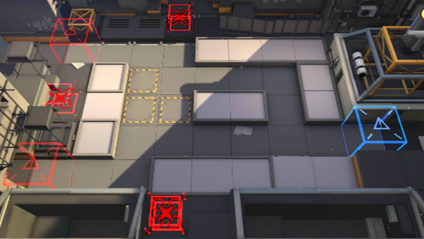

# 关卡一览————LS-1

## 关卡一览

关卡编号: LS-1

关卡名称: 遭遇战演习

目标点生命值: 10

敌人总数: 35

理智消耗: 10

## 关卡地图

## 敌人情况

| 敌人图片 | 敌人名称 | 数量  |
|---------|-----|-----|
| ./eneIcons/eneIcons/ÁÔ¹·.png| 猎狗  |   11  |
| ./eneIcons/eneIcons/Ê¿±ø.png| 士兵  |   3  |
| ./eneIcons/eneIcons/ÓÄÁé.png| 幽灵  |   4  |
| ./eneIcons/eneIcons/Դʯ³æ.png| 源石虫  |   9  |
| ./eneIcons/eneIcons/Դʯ³æ¡¤¦Á.png| 源石虫·α  |   8  |
