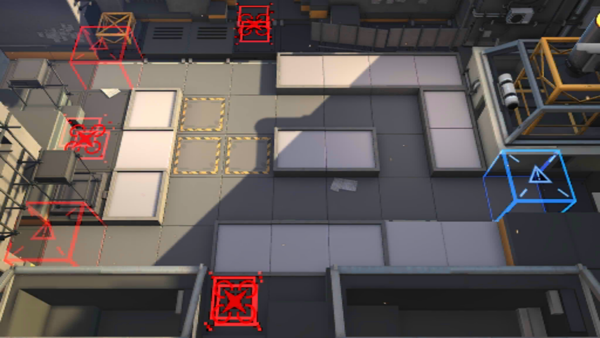

# 关卡一览————LS-2

## 关卡一览

关卡编号: LS-2

关卡名称: 游击战演习

目标点生命值: 10

敌人总数: 52

理智消耗: 15

## 关卡地图

## 敌人情况

| 敌人图片 | 敌人名称 | 数量  |
|---------|-----|-----|
| ./eneIcons/eneIcons/»ú¶¯¶Ü±ø.png| 机动盾兵  |   6  |
| ./eneIcons/eneIcons/ÁÔ¹·.png| 猎狗  |   11  |
| ./eneIcons/eneIcons/ÁÔ¹·pro.png| 猎狗pro  |   10  |
| ./eneIcons/eneIcons/Ñý¹Ö.png| 妖怪  |   10  |
| ./eneIcons/eneIcons/Դʯ³æ.png| 源石虫  |   15  |
