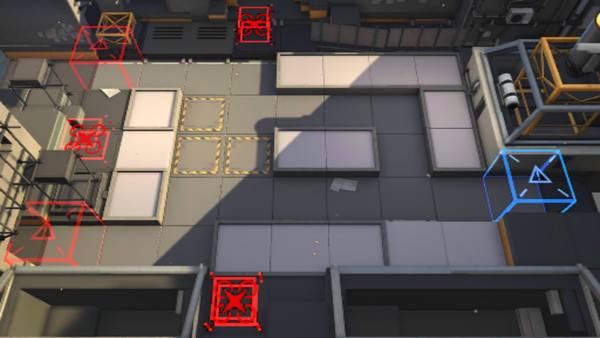

# 关卡一览————LS-3

## 关卡一览

关卡编号: LS-3

关卡名称: 阵地战演习

目标点生命值: 3

敌人总数: 55

理智消耗: 20

## 关卡地图

## 敌人情况

| 敌人图片 | 敌人名称 | 数量  |
|---------|-----|-----|
| ./eneIcons/eneIcons/·¥Ä¾»ú.png| 伐木机  |   2  |
| ./eneIcons/eneIcons/»ú¶¯¶Ü±ø.png| 机动盾兵  |   4  |
| ./eneIcons/eneIcons/¿ñ±©µÄÁÔ¹·pro.png| 狂暴的猎狗pro  |   9  |
| ./eneIcons/eneIcons/Ê°»ÄÕß.png| 拾荒者  |   2  |
| ./eneIcons/eneIcons/Ê¿±ø.png| 士兵  |   9  |
| ./eneIcons/eneIcons/Ñý¹Ö.png| 妖怪  |   2  |
| ./eneIcons/eneIcons/Ñý¹ÖMKII.png| 妖怪MKII  |   2  |
| ./eneIcons/eneIcons/Դʯ³æ¡¤¦Á.png| 源石虫·α  |   9  |
| ./eneIcons/eneIcons/Դʯ³æ¡¤¦Â.png| 源石虫·β  |   16  |
