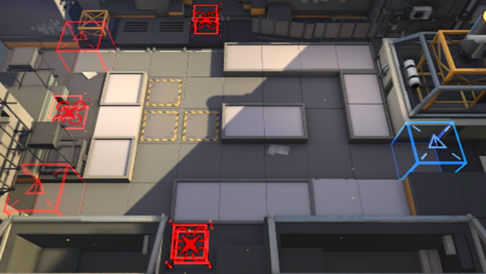

# 关卡一览————LS-4

## 关卡一览

关卡编号: LS-4

关卡名称: 特种战演习

目标点生命值: 3

敌人总数: 73

理智消耗: 25

## 关卡地图

## 敌人情况

| 敌人图片 | 敌人名称 | 数量  |
|---------|-----|-----|
| ./eneIcons/eneIcons/¿ñ±©µÄÁÔ¹·pro.png| 狂暴的猎狗pro  |   6  |
| ./eneIcons/eneIcons/Çá¼×ÎÀ±ø.png| 轻甲卫兵  |   10  |
| ./eneIcons/eneIcons/ÍÀ·ò.png| 屠夫  |   2  |
| ./eneIcons/eneIcons/Ñý¹Ö.png| 妖怪  |   8  |
| ./eneIcons/eneIcons/ÓÄÁé.png| 幽灵  |   12  |
| ./eneIcons/eneIcons/Դʯ³æ¡¤¦Á.png| 源石虫·α  |   35  |
