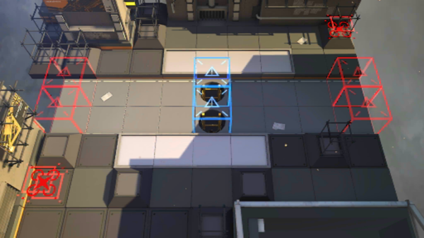

# 关卡一览————LS-5

## 关卡一览

关卡编号: LS-5

关卡名称: 歼灭战演习

目标点生命值: 3

敌人总数: 80

理智消耗: 30

## 关卡地图

## 敌人情况

| 敌人图片 | 敌人名称 | 数量  |
|---------|-----|-----|
| ./eneIcons/eneIcons/¿ñ±©µÄÁÔ¹·pro.png| 狂暴的猎狗pro  |   22  |
| ./eneIcons/eneIcons/ÁÔ¹·pro.png| 猎狗pro  |   6  |
| ./eneIcons/eneIcons/Á÷ÀËÕß.png| 流浪者  |   6  |
| ./eneIcons/eneIcons/Îä×°ÈËÔ±.png| 武装人员  |   2  |
| ./eneIcons/eneIcons/Ñý¹ÖMKII.png| 妖怪MKII  |   13  |
| ./eneIcons/eneIcons/Դʯ³æ¡¤¦Â.png| 源石虫·β  |   26  |
| ./eneIcons/eneIcons/ÖØ×°·ÀÓùÕß.png| 重装防御者  |   5  |
