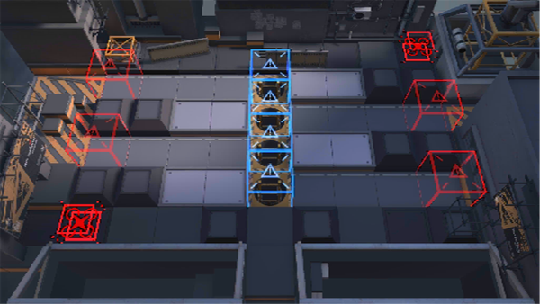

# 关卡一览————LS-6

## 关卡一览

关卡编号: LS-6

关卡名称: 运动战演习

目标点生命值: 3

敌人总数: 60

理智消耗: 36

## 关卡地图

## 敌人情况

| 敌人图片 | 敌人名称 | 数量  |
|---------|-----|-----|
| ./eneIcons/eneIcons/·¨Êõ´óʦA1.png| 法术大师A1  |   9  |
| ./eneIcons/eneIcons/¸´³ðÕß.png| 复仇者  |   1  |
| ./eneIcons/eneIcons/Ê¿±ø.png| 士兵  |   20  |
| ./eneIcons/eneIcons/ËéÑÒÕß.png| 碎岩者  |   2  |
| ./eneIcons/eneIcons/Óù4.png| 御4  |   16  |
| ./eneIcons/eneIcons/ÖØ×°·ÀÓùÕß.png| 重装防御者  |   12  |
