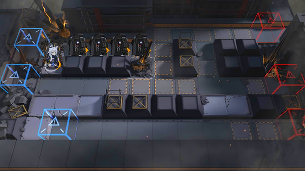

# 关卡一览————M8-6

## 关卡一览

关卡编号: M8-6

关卡名称: 再见，只为再见

目标点生命值: 3

敌人总数: 77

理智消耗: 18

## 关卡地图

## 敌人情况

| 敌人图片 | 敌人名称 | 数量  |
|---------|-----|-----|
| ./eneIcons/eneIcons/¿ñ±©ËÞÖ÷Ê¿±ø.png| 狂暴宿主士兵  |   45  |
| ./eneIcons/eneIcons/¿ñ±©ËÞÖ÷ÖÀ¹ÇÊÖ.png| 狂暴宿主掷骨手  |   5  |
| ./eneIcons/eneIcons/¿ñ±©ËÞÖ÷×鳤.png| 狂暴宿主组长  |   4  |
| ./eneIcons/eneIcons/Èø¿¨×ÈËÞÖ÷°Ù·ò³¤.png| 萨卡兹宿主百夫长  |   3  |
| ./eneIcons/eneIcons/ËÞÖ÷Ê°»ÄÕß.png| 宿主拾荒者  |   6  |
| ./eneIcons/eneIcons/ËÞÖ÷Ê¿±ø.png| 宿主士兵  |   11  |
| ./eneIcons/eneIcons/ËÞÖ÷ÖØ×°Ê¿±ø.png| 宿主重装士兵  |   3  |
