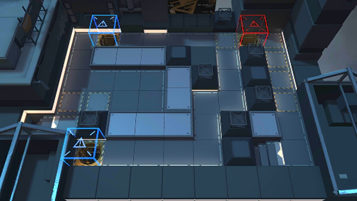

# 关卡一览————M8-7

## 关卡一览

关卡编号: M8-7

关卡名称: 恶言，报应不爽

目标点生命值: 3

敌人总数: 48

理智消耗: 21

## 关卡地图

## 敌人情况

| 敌人图片 | 敌人名称 | 数量  |
|---------|-----|-----|
| ./eneIcons/eneIcons/Èø¿¨×ÈËÞÖ÷°Ù·ò³¤.png| 萨卡兹宿主百夫长  |   3  |
| ./eneIcons/eneIcons/ËÞÖ÷Ê°»ÄÕß.png| 宿主拾荒者  |   15  |
| ./eneIcons/eneIcons/ËÞÖ÷Ê¿±ø.png| 宿主士兵  |   24  |
| ./eneIcons/eneIcons/ËÞÖ÷ÖØ×°Ê¿±ø.png| 宿主重装士兵  |   6  |
