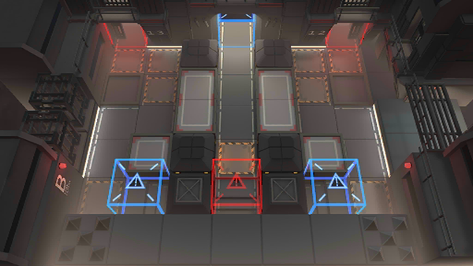

# 关卡一览————MB-1

## 关卡一览

关卡编号: MB-1

关卡名称: 密会

目标点生命值: 3

敌人总数: 15

理智消耗: 9

## 关卡地图

## 敌人情况

| 敌人图片 | 敌人名称 | 数量  |
|---------|-----|-----|
| ./eneIcons/eneIcons/ÆÕͨÇô·¸.png| 普通囚犯  |   11  |
| ./eneIcons/eneIcons/ÉäÊÖÇô·¸.png| 射手囚犯  |   4  |
