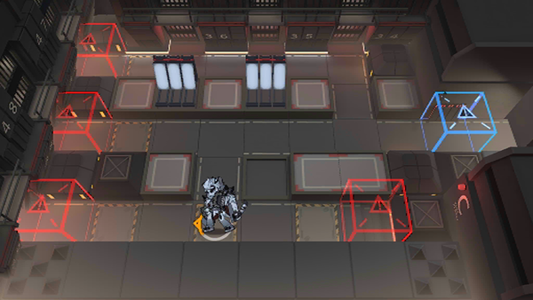

# 关卡一览————MB-3

## 关卡一览

关卡编号: MB-3

关卡名称: 首次遇袭

目标点生命值: 3

敌人总数: 26

理智消耗: 12

## 关卡地图

## 敌人情况

| 敌人图片 | 敌人名称 | 数量  |
|---------|-----|-----|
| ./eneIcons/eneIcons/ÆÕͨÇô·¸.png| 普通囚犯  |   14  |
| ./eneIcons/eneIcons/È­ÊÖÇô·¸.png| 拳手囚犯  |   5  |
| ./eneIcons/eneIcons/ÉäÊÖÇô·¸.png| 射手囚犯  |   7  |
