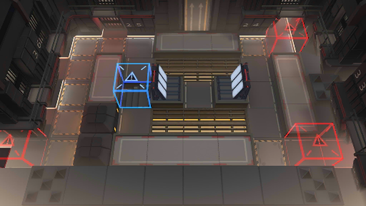

# 关卡一览————MB-EX-2

## 关卡一览

关卡编号: MB-EX-2

关卡名称: 三面楚歌

目标点生命值: 3

敌人总数: 22

理智消耗: 10

## 关卡地图

## 敌人情况

| 敌人图片 | 敌人名称 | 数量  |
|---------|-----|-----|
| ./eneIcons/eneIcons/ÀÏÁ·Çô·¸.png| 老练囚犯  |   10  |
| ./eneIcons/eneIcons/ǿ׳Çô·¸.png| 强壮囚犯  |   2  |
| ./eneIcons/eneIcons/ÉñÉäÊÖÇô·¸.png| 神射手囚犯  |   5  |
| ./eneIcons/eneIcons/ÊõʦÇô·¸.png| 术师囚犯  |   4  |
| ./eneIcons/eneIcons/ÖØ·¸.png| 重犯  |   1  |
