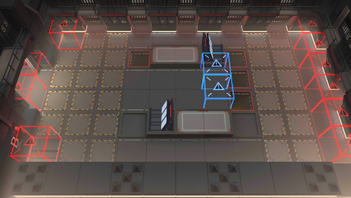

# 关卡一览————MB-EX-7

## 关卡一览

关卡编号: MB-EX-7

关卡名称: 施工中

目标点生命值: 3

敌人总数: 28

理智消耗: 20

## 关卡地图

## 敌人情况

| 敌人图片 | 敌人名称 | 数量  |
|---------|-----|-----|
| ./eneIcons/eneIcons/´«ÆæÖØ·¸.png| 传奇重犯  |   3  |
| ./eneIcons/eneIcons/ÀÏÁ·Çô·¸.png| 老练囚犯  |   5  |
| ./eneIcons/eneIcons/ÆÕͨÇô·¸.png| 普通囚犯  |   8  |
| ./eneIcons/eneIcons/ȭʦÇô·¸.png| 拳师囚犯  |   5  |
| ./eneIcons/eneIcons/ÉñÉäÊÖÇô·¸.png| 神射手囚犯  |   4  |
| ./eneIcons/eneIcons/ΣÏÕÊõʦÇô·¸.png| 危险术师囚犯  |   3  |
