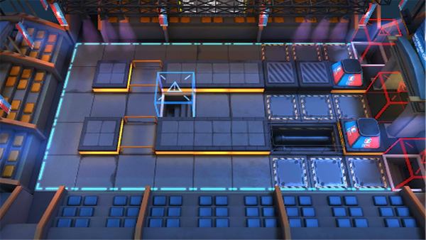

# 关卡一览————MN-2

## 关卡一览

关卡编号: MN-2

关卡名称: 呼啸守卫

目标点生命值: 3

敌人总数: 25

理智消耗: 9

## 关卡地图

## 敌人情况

| 敌人图片 | 敌人名称 | 数量  |
|---------|-----|-----|
| ./eneIcons/eneIcons/¡°ËÜÁÏ¡±ÉªÆæÑÇ¿Ë.png| “塑料”瑟奇亚克  |   1  |
| ./eneIcons/eneIcons/ºôÐ¥ÆïÊ¿ÍÅѧͽ.png| 呼啸骑士团学徒  |   8  |
| ./eneIcons/eneIcons/ÎÞÃû¶ÀÁ¢ÆïÊ¿.png| 无名独立骑士  |   12  |
| ./eneIcons/eneIcons/ÎÞÃû¾«ÈñÆïÊ¿.png| 无名精锐骑士  |   2  |
| ./eneIcons/eneIcons/ÔÞÖúÎÞÈË»ú.png| 赞助无人机  |   2  |
