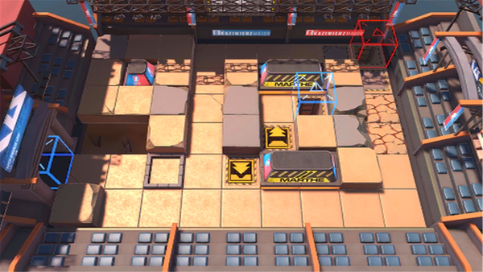

# 关卡一览————MN-4

## 关卡一览

关卡编号: MN-4

关卡名称: 辉煌盾工业

目标点生命值: 3

敌人总数: 48

理智消耗: 12

## 关卡地图

## 敌人情况

| 敌人图片 | 敌人名称 | 数量  |
|---------|-----|-----|
| ./eneIcons/eneIcons/³Ö¶Ü¶ÀÁ¢ÆïÊ¿.png| 持盾独立骑士  |   8  |
| ./eneIcons/eneIcons/ºôÐ¥ÆïÊ¿ÍÅѧͽ.png| 呼啸骑士团学徒  |   15  |
| ./eneIcons/eneIcons/ÎÞÃû¶ÀÁ¢ÆïÊ¿.png| 无名独立骑士  |   10  |
| ./eneIcons/eneIcons/ѵÁ·ÓÃǯÊÞ.png| 训练用钳兽  |   15  |
