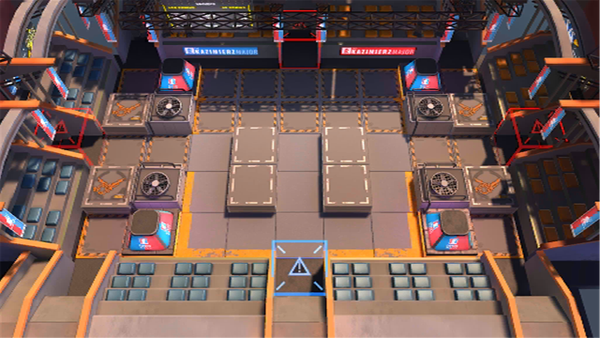

# 关卡一览————MN-5

## 关卡一览

关卡编号: MN-5

关卡名称: 斯沃玛视频

目标点生命值: 3

敌人总数: 49

理智消耗: 15

## 关卡地图

## 敌人情况

| 敌人图片 | 敌人名称 | 数量  |
|---------|-----|-----|
| ./eneIcons/eneIcons/³Ö¶Ü¶ÀÁ¢ÆïÊ¿.png| 持盾独立骑士  |   6  |
| ./eneIcons/eneIcons/¶·Ö¾°ºÑïÎÞÈË»ú.png| 斗志昂扬无人机  |   4  |
| ./eneIcons/eneIcons/·ÐѪÆïÊ¿ÍÅѧͽ.png| 沸血骑士团学徒  |   1  |
| ./eneIcons/eneIcons/ÎÞÃû¶ÀÁ¢ÆïÊ¿.png| 无名独立骑士  |   22  |
| ./eneIcons/eneIcons/ÎÞÃû¾«ÈñÆïÊ¿.png| 无名精锐骑士  |   2  |
| ./eneIcons/eneIcons/ѵÁ·ÓÃǯÊÞ.png| 训练用钳兽  |   14  |
