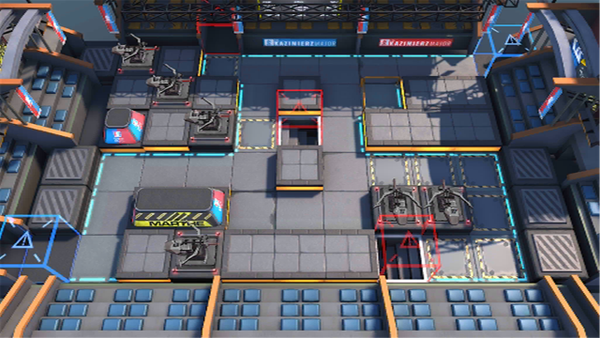

# 关卡一览————MN-6

## 关卡一览

关卡编号: MN-6

关卡名称: 蓝耳酒窖

目标点生命值: 3

敌人总数: 57

理智消耗: 15

## 关卡地图

## 敌人情况

| 敌人图片 | 敌人名称 | 数量  |
|---------|-----|-----|
| ./eneIcons/eneIcons/¶·Ö¾°ºÑïÎÞÈË»ú.png| 斗志昂扬无人机  |   3  |
| ./eneIcons/eneIcons/·ÐѪÆïÊ¿ÍÅѧͽ.png| 沸血骑士团学徒  |   7  |
| ./eneIcons/eneIcons/ºôÐ¥ÆïÊ¿ÍÅѧͽ.png| 呼啸骑士团学徒  |   5  |
| ./eneIcons/eneIcons/ÎÞÃû¶ÀÁ¢ÆïÊ¿.png| 无名独立骑士  |   12  |
| ./eneIcons/eneIcons/ѵÁ·ÓÃǯÊÞ.png| 训练用钳兽  |   4  |
| ./eneIcons/eneIcons/Դʯ³æ.png| 源石虫  |   4  |
| ./eneIcons/eneIcons/Դʯ³æ¡¤¦Á.png| 源石虫·α  |   6  |
| ./eneIcons/eneIcons/Դʯ³æ¡¤¦Â.png| 源石虫·β  |   14  |
| ./eneIcons/eneIcons/ÔÞÖúÎÞÈË»ú.png| 赞助无人机  |   2  |
