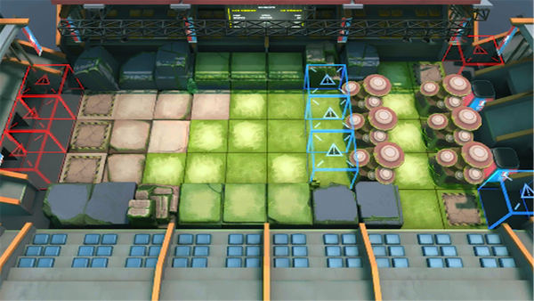

# 关卡一览————MN-7

## 关卡一览

关卡编号: MN-7

关卡名称: 梅什科集团

目标点生命值: 3

敌人总数: 44

理智消耗: 18

## 关卡地图

## 敌人情况

| 敌人图片 | 敌人名称 | 数量  |
|---------|-----|-----|
| ./eneIcons/eneIcons/¡°×óÊÖ¡±Ì©ÌØ˹¡¤°×Ñî.png| “左手”泰特斯·白杨  |   1  |
| ./eneIcons/eneIcons/³Ö¶Ü¶ÀÁ¢ÆïÊ¿.png| 持盾独立骑士  |   5  |
| ./eneIcons/eneIcons/·æ¿øÆïÊ¿ÍÅѧͽ.png| 锋盔骑士团学徒  |   2  |
| ./eneIcons/eneIcons/¹¤ÒÏ.png| 工蚁  |   5  |
| ./eneIcons/eneIcons/ºÀ»ªÔÞÖúÎÞÈË»ú.png| 豪华赞助无人机  |   1  |
| ./eneIcons/eneIcons/ÎÞÃû¶ÀÁ¢ÆïÊ¿.png| 无名独立骑士  |   11  |
| ./eneIcons/eneIcons/ѵÁ·ÓÃǯÊÞ.png| 训练用钳兽  |   14  |
| ./eneIcons/eneIcons/ÔÞÖúÎÞÈË»ú.png| 赞助无人机  |   5  |
