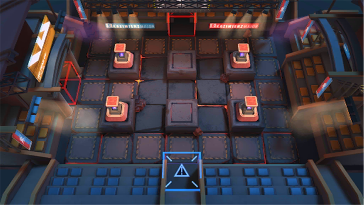

# 关卡一览————MN-EX-1

## 关卡一览

关卡编号: MN-EX-1

关卡名称: 通电测试

目标点生命值: 3

敌人总数: 77

理智消耗: 10

## 关卡地图

## 敌人情况

| 敌人图片 | 敌人名称 | 数量  |
|---------|-----|-----|
| ./eneIcons/eneIcons/ºôÐ¥ÆïÊ¿ÍÅѧͽ.png| 呼啸骑士团学徒  |   7  |
| ./eneIcons/eneIcons/ÎÞÃû¶ÀÁ¢ÆïÊ¿.png| 无名独立骑士  |   24  |
| ./eneIcons/eneIcons/ÎÞÃû¾«ÈñÆïÊ¿.png| 无名精锐骑士  |   24  |
| ./eneIcons/eneIcons/ѵÁ·Óòб©Ç¯ÊÞ.png| 训练用残暴钳兽  |   22  |
