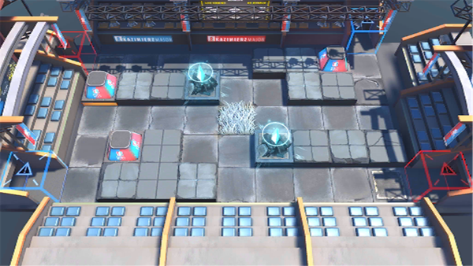

# 关卡一览————MN-EX-2

## 关卡一览

关卡编号: MN-EX-2

关卡名称: 对称冰河

目标点生命值: 3

敌人总数: 34

理智消耗: 10

## 关卡地图

## 敌人情况

| 敌人图片 | 敌人名称 | 数量  |
|---------|-----|-----|
| ./eneIcons/eneIcons/³Ö¶Ü¶ÀÁ¢ÆïÊ¿.png| 持盾独立骑士  |   2  |
| ./eneIcons/eneIcons/¶·Ö¾°ºÑïÎÞÈË»ú.png| 斗志昂扬无人机  |   3  |
| ./eneIcons/eneIcons/·ÐѪÆïÊ¿Íž«Èñ.png| 沸血骑士团精锐  |   1  |
| ./eneIcons/eneIcons/·æ¿øÆïÊ¿ÍÅѧͽ.png| 锋盔骑士团学徒  |   1  |
| ./eneIcons/eneIcons/ºôÐ¥ÆïÊ¿ÍÅѧͽ.png| 呼啸骑士团学徒  |   3  |
| ./eneIcons/eneIcons/ÎÞÃû¾«ÈñÆïÊ¿.png| 无名精锐骑士  |   12  |
| ./eneIcons/eneIcons/ѵÁ·Óòб©Ç¯ÊÞ.png| 训练用残暴钳兽  |   10  |
| ./eneIcons/eneIcons/ѵÁ·ÓÃǯÊÞ.png| 训练用钳兽  |   2  |
