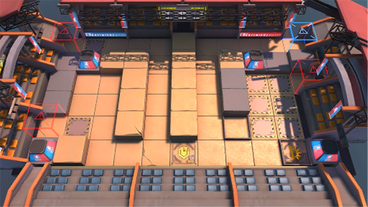

# 关卡一览————MN-EX-4

## 关卡一览

关卡编号: MN-EX-4

关卡名称: 左右逢敌

目标点生命值: 3

敌人总数: 39

理智消耗: 15

## 关卡地图

## 敌人情况

| 敌人图片 | 敌人名称 | 数量  |
|---------|-----|-----|
| ./eneIcons/eneIcons/·ÐѪÆïÊ¿Íž«Èñ.png| 沸血骑士团精锐  |   9  |
| ./eneIcons/eneIcons/ºÀ»ªÔÞÖúÎÞÈË»ú.png| 豪华赞助无人机  |   1  |
| ./eneIcons/eneIcons/ºôÐ¥ÆïÊ¿Íž«Èñ.png| 呼啸骑士团精锐  |   2  |
| ./eneIcons/eneIcons/ÎÞÃû¾«ÈñÆïÊ¿.png| 无名精锐骑士  |   12  |
| ./eneIcons/eneIcons/ѵÁ·ÓÃǯÊÞ.png| 训练用钳兽  |   14  |
| ./eneIcons/eneIcons/ÔÞÖúÎÞÈË»ú.png| 赞助无人机  |   1  |
