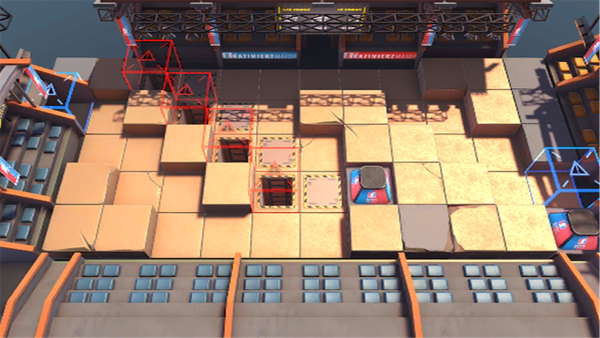

# 关卡一览————MN-EX-7

## 关卡一览

关卡编号: MN-EX-7

关卡名称: 左手之战

目标点生命值: 3

敌人总数: 43

理智消耗: 20

## 关卡地图

## 敌人情况

| 敌人图片 | 敌人名称 | 数量  |
|---------|-----|-----|
| ./eneIcons/eneIcons/¡°×óÊÖ¡±Ì©ÌØ˹¡¤°×Ñî.png| “左手”泰特斯·白杨  |   1  |
| ./eneIcons/eneIcons/³Ö¶Ü¾«ÈñÆïÊ¿.png| 持盾精锐骑士  |   4  |
| ./eneIcons/eneIcons/ºÀ»ªÔÞÖúÎÞÈË»ú.png| 豪华赞助无人机  |   2  |
| ./eneIcons/eneIcons/ÍþÁú.png| 威龙  |   4  |
| ./eneIcons/eneIcons/ÎÞÃû¾«ÈñÆïÊ¿.png| 无名精锐骑士  |   24  |
| ./eneIcons/eneIcons/ѵÁ·Óòб©Ç¯ÊÞ.png| 训练用残暴钳兽  |   8  |
