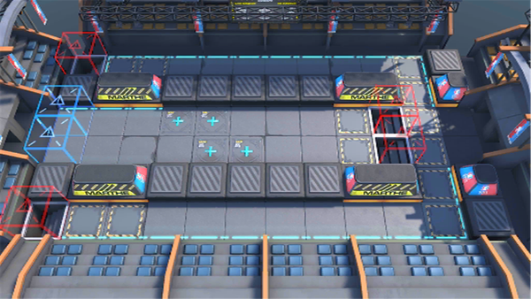

# 关卡一览————MN-EX-8

## 关卡一览

关卡编号: MN-EX-8

关卡名称: 古老对决

目标点生命值: 3

敌人总数: 28

理智消耗: 20

## 关卡地图

## 敌人情况

| 敌人图片 | 敌人名称 | 数量  |
|---------|-----|-----|
| ./eneIcons/eneIcons/³Ö¶Ü¾«ÈñÆïÊ¿.png| 持盾精锐骑士  |   2  |
| ./eneIcons/eneIcons/µòÁãÆïÊ¿.png| 凋零骑士  |   1  |
| ./eneIcons/eneIcons/·ÐѪÆïÊ¿Íž«Èñ.png| 沸血骑士团精锐  |   4  |
| ./eneIcons/eneIcons/·æ¿øÆïÊ¿Íž«Èñ.png| 锋盔骑士团精锐  |   2  |
| ./eneIcons/eneIcons/¸¯°ÜÆïÊ¿.png| 腐败骑士  |   1  |
| ./eneIcons/eneIcons/ºôÐ¥ÆïÊ¿Íž«Èñ.png| 呼啸骑士团精锐  |   2  |
| ./eneIcons/eneIcons/ÎÞÃû¾«ÈñÆïÊ¿.png| 无名精锐骑士  |   4  |
| ./eneIcons/eneIcons/ѵÁ·Óòб©Ç¯ÊÞ.png| 训练用残暴钳兽  |   4  |
| ./eneIcons/eneIcons/ÔÞÖúÎÞÈË»ú.png| 赞助无人机  |   8  |
