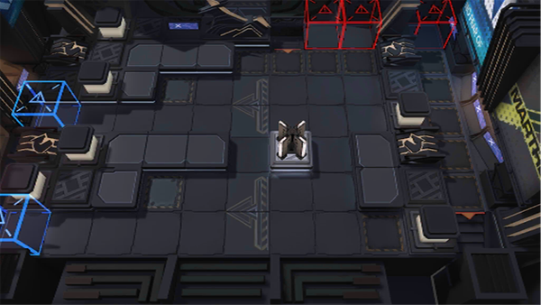

# 关卡一览————NL-10

## 关卡一览

关卡编号: NL-10

关卡名称: 耀骑士

目标点生命值: 3

敌人总数: 24

理智消耗: 18

## 关卡地图

## 敌人情况

| 敌人图片 | 敌人名称 | 数量  |
|---------|-----|-----|
| ./eneIcons/eneIcons/°µ³±Ç¯ÊÞ.png| 暗潮钳兽  |   10  |
| ./eneIcons/eneIcons/ÃÎ÷ÊЧ·ÂÕß.png| 梦魇效仿者  |   2  |
| ./eneIcons/eneIcons/ÄýѪ֮ÈÐ.png| 凝血之刃  |   0  |
| ./eneIcons/eneIcons/ÎÞÃû¶ÀÁ¢ÆïÊ¿.png| 无名独立骑士  |   7  |
| ./eneIcons/eneIcons/ÎÞëÐÃ˵ÚÈýС¶Ó.png| 无胄盟第三小队  |   2  |
| ./eneIcons/eneIcons/ÎÞëÐÃËÇåɨС¶Ó.png| 无胄盟清扫小队  |   2  |
| ./eneIcons/eneIcons/ѪÆïÊ¿µÒ¿ª¶í²¨Àû˹.png| 血骑士狄开俄波利斯  |   1  |
