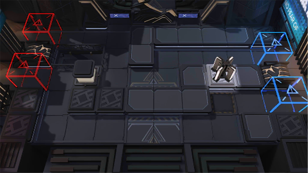

# 关卡一览————NL-1

## 关卡一览

关卡编号: NL-1

关卡名称: 金盏花

目标点生命值: 3

敌人总数: 20

理智消耗: 9

## 关卡地图

## 敌人情况

| 敌人图片 | 敌人名称 | 数量  |
|---------|-----|-----|
| ./eneIcons/eneIcons/°µ³±Ç¯ÊÞ.png| 暗潮钳兽  |   5  |
| ./eneIcons/eneIcons/ÎÞëÐÃËåóÊÖ.png| 无胄盟弩手  |   2  |
| ./eneIcons/eneIcons/Õ½ÊõÁÔÈ®.png| 战术猎犬  |   13  |
