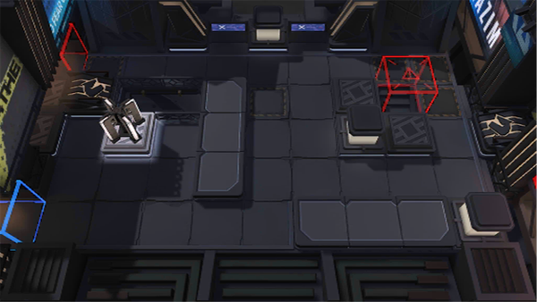

# 关卡一览————NL-3

## 关卡一览

关卡编号: NL-3

关卡名称: 筹备着

目标点生命值: 3

敌人总数: 25

理智消耗: 9

## 关卡地图

## 敌人情况

| 敌人图片 | 敌人名称 | 数量  |
|---------|-----|-----|
| ./eneIcons/eneIcons/°µ³±Ç¯ÊÞ.png| 暗潮钳兽  |   9  |
| ./eneIcons/eneIcons/É¢»ªÆïÊ¿ÍÅѧͽ.png| 散华骑士团学徒  |   2  |
| ./eneIcons/eneIcons/ÎÞÃû¶ÀÁ¢ÆïÊ¿.png| 无名独立骑士  |   10  |
| ./eneIcons/eneIcons/ÎÞëÐÃË´Ì¿Í.png| 无胄盟刺客  |   4  |
