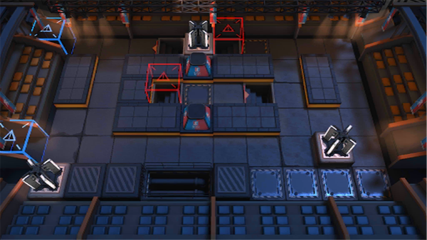

# 关卡一览————NL-4

## 关卡一览

关卡编号: NL-4

关卡名称: 诗的容貌

目标点生命值: 3

敌人总数: 21

理智消耗: 12

## 关卡地图

## 敌人情况

| 敌人图片 | 敌人名称 | 数量  |
|---------|-----|-----|
| ./eneIcons/eneIcons/³Ö¶Ü¶ÀÁ¢ÆïÊ¿.png| 持盾独立骑士  |   3  |
| ./eneIcons/eneIcons/ÎÞÃû¶ÀÁ¢ÆïÊ¿.png| 无名独立骑士  |   14  |
| ./eneIcons/eneIcons/ÎÞëÐÃËåóÊÖ.png| 无胄盟弩手  |   3  |
| ./eneIcons/eneIcons/ÖòÆïÊ¿Þ±Þ±°²ÄÈ.png| 烛骑士薇薇安娜  |   1  |
