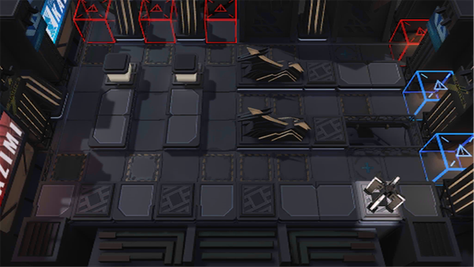

# 关卡一览————NL-5

## 关卡一览

关卡编号: NL-5

关卡名称: 人言可畏

目标点生命值: 3

敌人总数: 50

理智消耗: 12

## 关卡地图

## 敌人情况

| 敌人图片 | 敌人名称 | 数量  |
|---------|-----|-----|
| ./eneIcons/eneIcons/°µ³±Ç¯ÊÞ.png| 暗潮钳兽  |   6  |
| ./eneIcons/eneIcons/Çà½ð£¬ÂÞÒÁ.png| 青金，罗伊  |   1  |
| ./eneIcons/eneIcons/Çà½ð£¬ÄªÄÝ¿Ë.png| 青金，莫妮克  |   1  |
| ./eneIcons/eneIcons/ÎÞÃû¶ÀÁ¢ÆïÊ¿.png| 无名独立骑士  |   27  |
| ./eneIcons/eneIcons/ÎÞëÐÃËåóÊÖ.png| 无胄盟弩手  |   15  |
