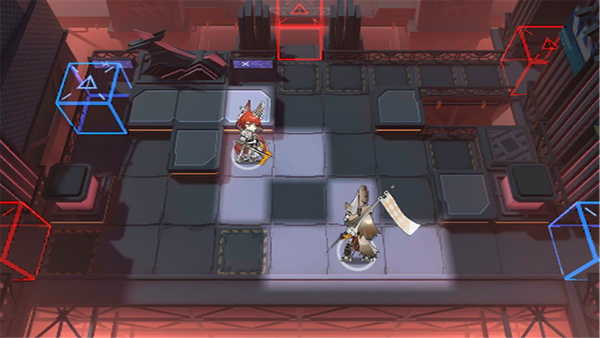

# 关卡一览————NL-6

## 关卡一览

关卡编号: NL-6

关卡名称: 被包围者

目标点生命值: 3

敌人总数: 49

理智消耗: 15

## 关卡地图

## 敌人情况

| 敌人图片 | 敌人名称 | 数量  |
|---------|-----|-----|
| ./eneIcons/eneIcons/°µ³±Ç¯ÊÞ.png| 暗潮钳兽  |   36  |
| ./eneIcons/eneIcons/ÆïÊ¿ÁìÓε´Õß.png| 骑士领游荡者  |   3  |
| ./eneIcons/eneIcons/ÎÞëÐÃË´Ì¿Í.png| 无胄盟刺客  |   2  |
| ./eneIcons/eneIcons/ÎÞëÐÃËåóÊÖ.png| 无胄盟弩手  |   8  |
