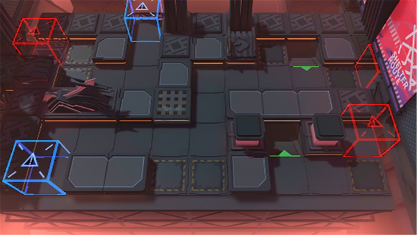

# 关卡一览————NL-7

## 关卡一览

关卡编号: NL-7

关卡名称: 梦的余韵

目标点生命值: 3

敌人总数: 40

理智消耗: 15

## 关卡地图

## 敌人情况

| 敌人图片 | 敌人名称 | 数量  |
|---------|-----|-----|
| ./eneIcons/eneIcons/°µ³±Ç¯ÊÞ.png| 暗潮钳兽  |   8  |
| ./eneIcons/eneIcons/ÆïÊ¿ÁìÓε´Õß.png| 骑士领游荡者  |   3  |
| ./eneIcons/eneIcons/ÎÞÃû¶ÀÁ¢ÆïÊ¿.png| 无名独立骑士  |   13  |
| ./eneIcons/eneIcons/ÎÞëÐÃË´Ì¿Í.png| 无胄盟刺客  |   9  |
| ./eneIcons/eneIcons/ÎÞëÐÃ˵ÚÈýС¶Ó.png| 无胄盟第三小队  |   5  |
| ./eneIcons/eneIcons/ÎÞëÐÃËÇåɨС¶Ó.png| 无胄盟清扫小队  |   2  |
