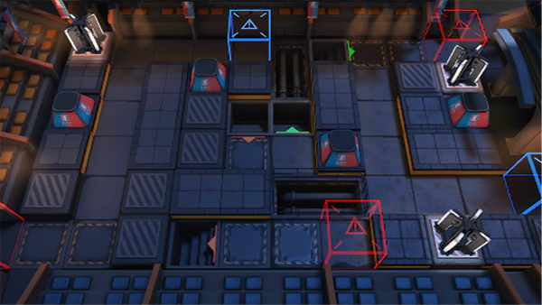

# 关卡一览————NL-8

## 关卡一览

关卡编号: NL-8

关卡名称: 最后的怯薛

目标点生命值: 3

敌人总数: 51

理智消耗: 18

## 关卡地图

## 敌人情况

| 敌人图片 | 敌人名称 | 数量  |
|---------|-----|-----|
| ./eneIcons/eneIcons/¡°×îºóµÄÇÓѦ¡±£¬ÍØÀ­.png| “最后的怯薛”，拓拉  |   1  |
| ./eneIcons/eneIcons/°µ³±Ç¯ÊÞ.png| 暗潮钳兽  |   5  |
| ./eneIcons/eneIcons/³Ö¶Ü¶ÀÁ¢ÆïÊ¿.png| 持盾独立骑士  |   7  |
| ./eneIcons/eneIcons/ÆïÊ¿ÁìÓε´Õß.png| 骑士领游荡者  |   7  |
| ./eneIcons/eneIcons/É¢»ªÆïÊ¿ÍÅѧͽ.png| 散华骑士团学徒  |   3  |
| ./eneIcons/eneIcons/ÎÞÃû¶ÀÁ¢ÆïÊ¿.png| 无名独立骑士  |   28  |
