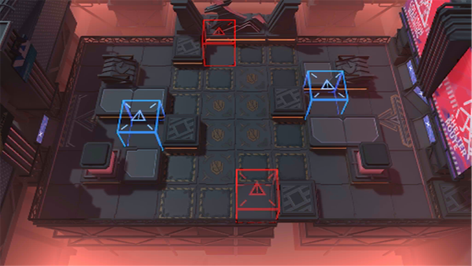

# 关卡一览————NL-9

## 关卡一览

关卡编号: NL-9

关卡名称: 叹息

目标点生命值: 3

敌人总数: 45

理智消耗: 18

## 关卡地图

## 敌人情况

| 敌人图片 | 敌人名称 | 数量  |
|---------|-----|-----|
| ./eneIcons/eneIcons/°µ³±Ç¯ÊÞ.png| 暗潮钳兽  |   13  |
| ./eneIcons/eneIcons/³Ö¶Ü¶ÀÁ¢ÆïÊ¿.png| 持盾独立骑士  |   2  |
| ./eneIcons/eneIcons/ÃÎ÷ÊЧ·ÂÕß.png| 梦魇效仿者  |   3  |
| ./eneIcons/eneIcons/É¢»ªÆïÊ¿ÍÅѧͽ.png| 散华骑士团学徒  |   5  |
| ./eneIcons/eneIcons/ÎÞëÐÃË´Ì¿Í.png| 无胄盟刺客  |   16  |
| ./eneIcons/eneIcons/ÎÞëÐÃËåóÊÖ.png| 无胄盟弩手  |   6  |
