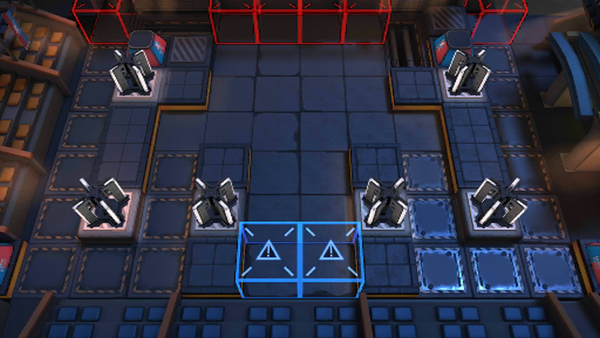

# 关卡一览————NL-EX-1

## 关卡一览

关卡编号: NL-EX-1

关卡名称: 都市怪谈

目标点生命值: 3

敌人总数: 73

理智消耗: 10

## 关卡地图

## 敌人情况

| 敌人图片 | 敌人名称 | 数量  |
|---------|-----|-----|
| ./eneIcons/eneIcons/°µ³±Ç¯ÊÞ.png| 暗潮钳兽  |   44  |
| ./eneIcons/eneIcons/ÎÞëÐÃË´Ì¿Í×鳤.png| 无胄盟刺客组长  |   25  |
| ./eneIcons/eneIcons/ÎÞëÐÃËåóÊÖ×鳤.png| 无胄盟弩手组长  |   4  |
