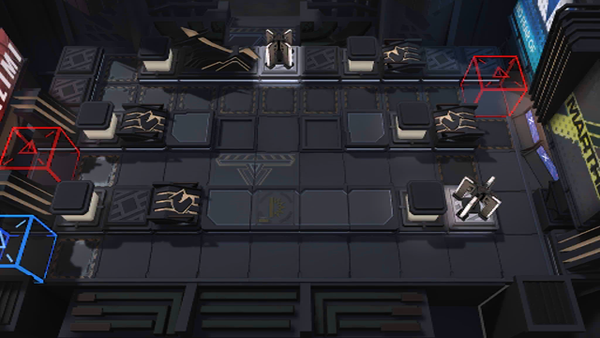

# 关卡一览————NL-EX-2

## 关卡一览

关卡编号: NL-EX-2

关卡名称: 合理推测

目标点生命值: 3

敌人总数: 52

理智消耗: 10

## 关卡地图

## 敌人情况

| 敌人图片 | 敌人名称 | 数量  |
|---------|-----|-----|
| ./eneIcons/eneIcons/°µ³±Ç¯ÊÞ¡¤¦Á.png| 暗潮钳兽·α  |   13  |
| ./eneIcons/eneIcons/ÆïÊ¿ÁìÕÝ·üÕß.png| 骑士领蛰伏者  |   2  |
| ./eneIcons/eneIcons/ÎÞÃû¾«ÈñÆïÊ¿.png| 无名精锐骑士  |   20  |
| ./eneIcons/eneIcons/ÎÞëÐÃË´Ì¿Í×鳤.png| 无胄盟刺客组长  |   12  |
| ./eneIcons/eneIcons/ÎÞëÐÃËåóÊÖ×鳤.png| 无胄盟弩手组长  |   5  |
