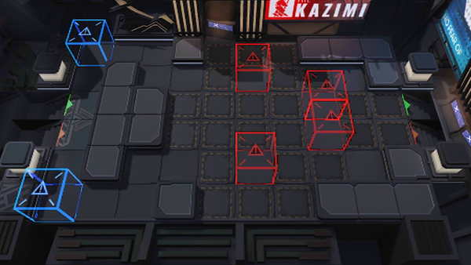

# 关卡一览————NL-EX-4

## 关卡一览

关卡编号: NL-EX-4

关卡名称: 自由买卖

目标点生命值: 3

敌人总数: 91

理智消耗: 15

## 关卡地图

## 敌人情况

| 敌人图片 | 敌人名称 | 数量  |
|---------|-----|-----|
| ./eneIcons/eneIcons/É¢»ªÆïÊ¿ÍÅѧͽ.png| 散华骑士团学徒  |   6  |
| ./eneIcons/eneIcons/ÎÞÃû¶ÀÁ¢ÆïÊ¿.png| 无名独立骑士  |   61  |
| ./eneIcons/eneIcons/ÎÞÃû¾«ÈñÆïÊ¿.png| 无名精锐骑士  |   12  |
| ./eneIcons/eneIcons/ÎÞëÐÃË´Ì¿Í×鳤.png| 无胄盟刺客组长  |   4  |
| ./eneIcons/eneIcons/ÎÞëÐÃ˵ÚÈýС¶Ó.png| 无胄盟第三小队  |   2  |
| ./eneIcons/eneIcons/ÎÞëÐÃ˵ÚÈýС¶Ó×鳤.png| 无胄盟第三小队组长  |   2  |
| ./eneIcons/eneIcons/ÎÞëÐÃËÇåɨС¶Ó.png| 无胄盟清扫小队  |   2  |
| ./eneIcons/eneIcons/ÎÞëÐÃËÇåɨС¶Ó×鳤.png| 无胄盟清扫小队组长  |   2  |
