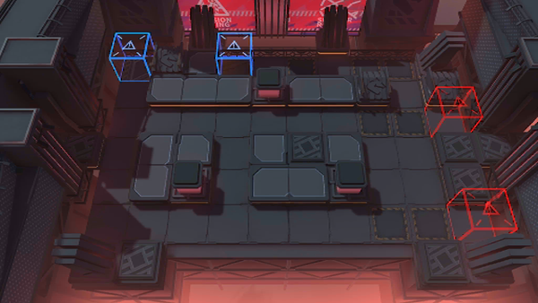

# 关卡一览————NL-EX-5

## 关卡一览

关卡编号: NL-EX-5

关卡名称: 狂热粉丝

目标点生命值: 3

敌人总数: 39

理智消耗: 15

## 关卡地图

## 敌人情况

| 敌人图片 | 敌人名称 | 数量  |
|---------|-----|-----|
| ./eneIcons/eneIcons/°µ³±Ç¯ÊÞ¡¤¦Á.png| 暗潮钳兽·α  |   10  |
| ./eneIcons/eneIcons/³Ö¶Ü¾«ÈñÆïÊ¿.png| 持盾精锐骑士  |   4  |
| ./eneIcons/eneIcons/ÃÎ÷Ê×·ËæÕß.png| 梦魇追随者  |   2  |
| ./eneIcons/eneIcons/ÎÞÃû¾«ÈñÆïÊ¿.png| 无名精锐骑士  |   10  |
| ./eneIcons/eneIcons/ÎÞëÐÃ˵ÚÈýС¶Ó×鳤.png| 无胄盟第三小队组长  |   3  |
| ./eneIcons/eneIcons/ÎÞëÐÃËåóÊÖ×鳤.png| 无胄盟弩手组长  |   8  |
| ./eneIcons/eneIcons/ÎÞëÐÃËÇåɨС¶Ó×鳤.png| 无胄盟清扫小队组长  |   2  |
