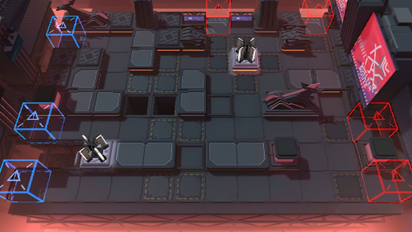

# 关卡一览————NL-EX-7

## 关卡一览

关卡编号: NL-EX-7

关卡名称: 后援联谊会

目标点生命值: 3

敌人总数: 66

理智消耗: 20

## 关卡地图

## 敌人情况

| 敌人图片 | 敌人名称 | 数量  |
|---------|-----|-----|
| ./eneIcons/eneIcons/°µ³±Ç¯ÊÞ¡¤¦Á.png| 暗潮钳兽·α  |   11  |
| ./eneIcons/eneIcons/³Ö¶Ü¾«ÈñÆïÊ¿.png| 持盾精锐骑士  |   4  |
| ./eneIcons/eneIcons/¹¤ÒÏ.png| 工蚁  |   15  |
| ./eneIcons/eneIcons/¹¤ÒÏ×鳤.png| 工蚁组长  |   10  |
| ./eneIcons/eneIcons/ÃÎ÷Ê×·ËæÕß.png| 梦魇追随者  |   1  |
| ./eneIcons/eneIcons/ÆïÊ¿ÁìÕÝ·üÕß.png| 骑士领蛰伏者  |   4  |
| ./eneIcons/eneIcons/É¢»ªÆïÊ¿Íž«Èñ.png| 散华骑士团精锐  |   4  |
| ./eneIcons/eneIcons/ÎÞÃû¾«ÈñÆïÊ¿.png| 无名精锐骑士  |   17  |
