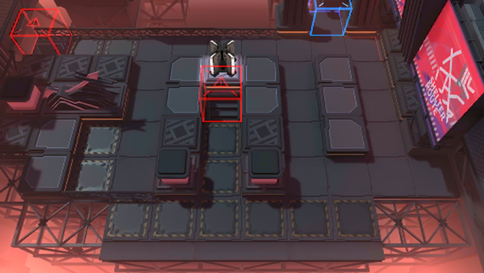

# 关卡一览————NL-EX-8

## 关卡一览

关卡编号: NL-EX-8

关卡名称: 独家专访

目标点生命值: 3

敌人总数: 35

理智消耗: 20

## 关卡地图

## 敌人情况

| 敌人图片 | 敌人名称 | 数量  |
|---------|-----|-----|
| ./eneIcons/eneIcons/°µ³±Ç¯ÊÞ¡¤¦Á.png| 暗潮钳兽·α  |   20  |
| ./eneIcons/eneIcons/ÃÎ÷Ê×·ËæÕß.png| 梦魇追随者  |   4  |
| ./eneIcons/eneIcons/ÄýѪ֮ÈÐ.png| 凝血之刃  |   0  |
| ./eneIcons/eneIcons/ÆïÊ¿ÁìÕÝ·üÕß.png| 骑士领蛰伏者  |   5  |
| ./eneIcons/eneIcons/É¢»ªÆïÊ¿Íž«Èñ.png| 散华骑士团精锐  |   5  |
| ./eneIcons/eneIcons/ѪÆïÊ¿µÒ¿ª¶í²¨Àû˹.png| 血骑士狄开俄波利斯  |   1  |
