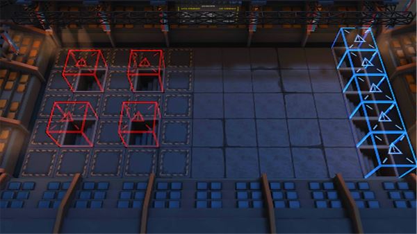

# 关卡一览————NL-S-1

## 关卡一览

关卡编号: NL-S-1

关卡名称: 联合会大楼暗道

目标点生命值: 3

敌人总数: 45

理智消耗: 15

## 关卡地图

## 敌人情况

| 敌人图片 | 敌人名称 | 数量  |
|---------|-----|-----|
| ./eneIcons/eneIcons/³Ö¶Ü¾«ÈñÆïÊ¿.png| 持盾精锐骑士  |   7  |
| ./eneIcons/eneIcons/¶·Ö¾°ºÑïÎÞÈË»ú.png| 斗志昂扬无人机  |   3  |
| ./eneIcons/eneIcons/ÃÎ÷Ê×·ËæÕß.png| 梦魇追随者  |   2  |
| ./eneIcons/eneIcons/É¢»ªÆïÊ¿Íž«Èñ.png| 散华骑士团精锐  |   3  |
| ./eneIcons/eneIcons/ÎÞÃû¾«ÈñÆïÊ¿.png| 无名精锐骑士  |   30  |
| ./eneIcons/eneIcons/ÎÞëÐÃ˵ÚÈýС¶Ó×鳤.png| 无胄盟第三小队组长  |   0  |
| ./eneIcons/eneIcons/ÎÞëÐÃËÇåɨС¶Ó×鳤.png| 无胄盟清扫小队组长  |   0  |
